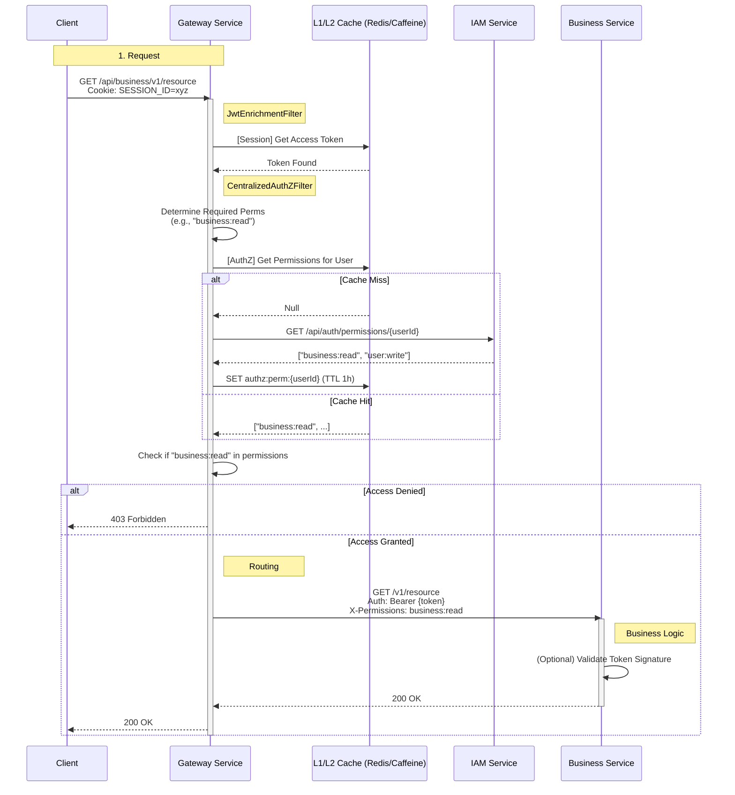

# API Workflow: Centralized Authorization (Gateway AuthZ)

This workflow is optimized for **1 Million CCU** by centralizing Authorization checks at the Gateway using Multi-Level Caching (Redis + Caffeine), reducing load on downstream services.

## Architecture Diagram

## Critical Performance Components

### 1. Multi-Level Caching
To handle 1M users, we cannot query IAM for every HTTP request.
*   **L1 Cache (Caffeine - Heap)**: Stores permissions for active users. TTL ~60s. Access: **Microseconds**.
*   **L2 Cache (Redis - Distributed)**: Stores permissions. TTL ~1h. Access: **Milliseconds**.

### 2. Authorization Logic
*   **Map-based Matching**: Gateway holds a config map of `Path Pattern -> Permission`.
    *   `/api/business/v1/products/**` (GET) -> `business:product:read`
    *   `/api/business/v1/orders/**` (POST) -> `business:order:create`

### 3. Failover
*   If Redis is down, Gateway *can* fall back to calling IAM directly (with circuit breaker) or deny access defensively.

## Repo Review Status

Use of this workflow requires code changes:
*   [ ] **Gateway**: Need `AuthZService` and `CentralizedAuthZFilter`.
*   [ ] **IAM**: Need `/api/auth/permissions` endpoint.
*   [ ] **Business**: Can simplify security config (trust Gateway or keep simple JWT check).

This implementation is **feasibly scalable** to 1M CCU if caching is tuned correctly.
