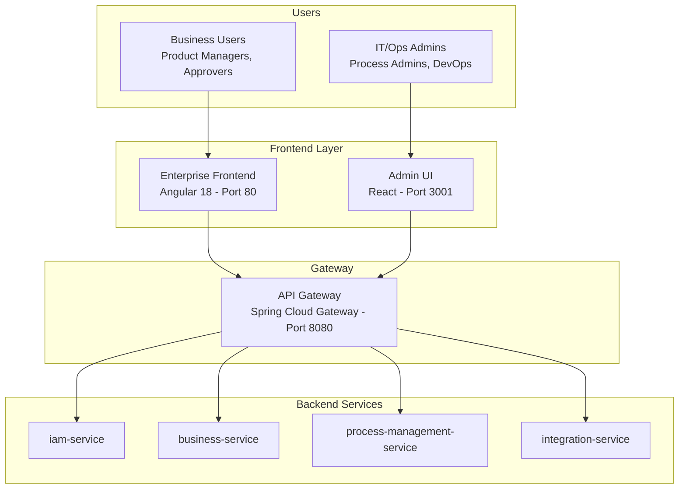
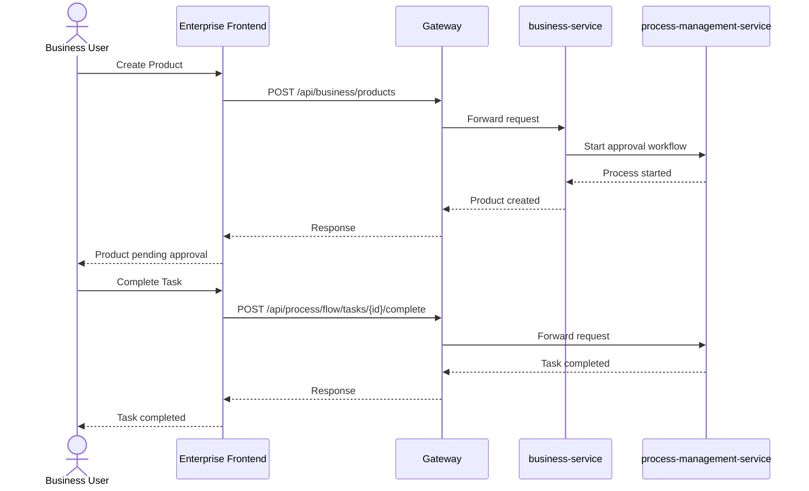
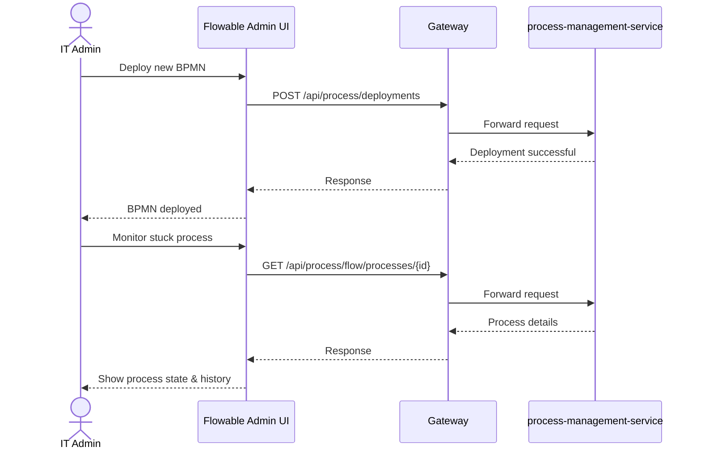
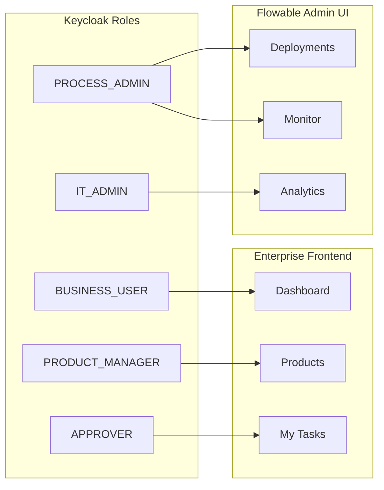

# SPA Architecture Documentation

## Overview

Hệ thống sử dụng **2 Single Page Applications (SPA)** riêng biệt, mỗi ứng dụng phục vụ một nhóm người dùng khác nhau với vai trò và chức năng rõ ràng.

---

## Architecture Diagram



---

## SPA 1: Enterprise Frontend

| Attribute | Value |
|-----------|-------|
| **Technology** | Angular 18 + Material Design |
| **Port** | 80 (Production) / 4200 (Dev) |
| **Location** | `frontend/` |
| **Target Users** | Business Users (Product Managers, Approvers) |
| **Auth** | Keycloak OIDC |

### Features

| Module | Route | Description |
|--------|-------|-------------|
| Dashboard | `/dashboard` | Business KPIs, pending tasks summary |
| Products | `/products` | Product CRUD, submit for approval |
| My Tasks | `/workflow/tasks` | Tasks assigned to current user |
| Customers | `/customers` | Customer management |
| Organizations | `/organizations` | Organization management |
| Users | `/users` | User management |
| Settings | `/settings` | User preferences |

### Key Interactions



---

## SPA 2: Admin UI

| Attribute | Value |
|-----------|-------|
| **Technology** | React 18 + Ant Design + TailwindCSS |
| **Port** | 3001 (Production) / 3000 (Dev) |
| **Location** | `admin-ui/` |
| **Target Users** | IT/Operations Admins |
| **Auth** | (Future: Keycloak) |

### Features

| Module | Route | Description |
|--------|-------|-------------|
| Operations Dashboard | `/process-management/dashboard` | Process metrics, system health |
| Process Monitor | `/process-management/monitor` | Real-time process tracking |
| Deployment Center | `/process-management/deployments` | BPMN deployment management |
| Version Diff | `/deployments/:id/diff` | Compare BPMN versions |
| DMN Management | `/decisions` | Decision table configuration |
| Analytics Dashboard | `/analytics/dashboard` | Deep workflow analytics |
| Service Catalog | `/integration/catalog` | API integrations |

### Key Interactions



---

## Role Separation Summary

| Capability | Enterprise Frontend | Flowable Admin UI |
|------------|---------------------|-------------------|
| View own tasks | ✅ | ❌ |
| Approve/Reject products | ✅ | ❌ |
| Create products | ✅ | ❌ |
| Deploy BPMN | ❌ | ✅ |
| Monitor all processes | ❌ | ✅ |
| Configure DMN | ❌ | ✅ |
| Deep analytics | ❌ | ✅ |
| Troubleshoot workflows | ❌ | ✅ |
| Manage users | ✅ | ❌ |

---

## Access Control



---

## Deployment

| Environment | Enterprise Frontend | Flowable Admin UI |
|-------------|---------------------|-------------------|
| Development | http://localhost:4200 | http://localhost:3000 |
| Production | https://app.enterprise.com | https://admin.enterprise.com |

Both SPAs communicate with backend through the same **API Gateway** on port 8080.

---

## API Endpoints Usage

### Enterprise Frontend consumes:
```
/api/business/*          → business-service
/api/iam/*               → iam-service
/api/process/flow/tasks  → process-management-service (user's tasks only)
```

### Flowable Admin UI consumes:
```
/api/process/flow/*       → All process management
/api/process/analytics/*  → All analytics
/api/process/deployments  → Deployment management
/api/process/decisions/*  → DMN management
```
